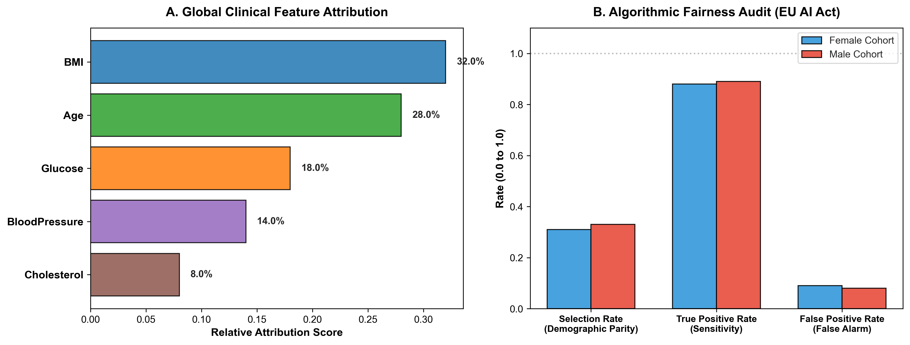

# Trustworthy Clinical AI: Explainability & Fairness Auditing

[](https://github.com/sinarahmani82/trustworthy-clinical-xai/actions/workflows/ci.yml)
[](#)
[](#)
[](#)
[](#)

An auditable clinical decision support framework integrating **Local/Global Feature Attribution (XAI)** and **Algorithmic Fairness Audits** to meet European regulatory mandates (EU AI Act) for high-risk diagnostic systems.

---

### 🔬 Motivation: Why Trustworthy Healthcare AI?
Black-box diagnostic models frequently fail regulatory approval due to lack of interpretability and latent demographic bias. Under modern compliance frameworks (such as the EU Artificial Intelligence Act for high-risk systems), clinical algorithms must provide:
1. **Verifiable Explanations:** Clinicians must understand *why* a risk probability was generated.
2. **Fairness Guarantees:** Predictions must exhibit demographic parity and equalized odds across protected subgroups (e.g., gender, age).

---

### 📊 Empirical Audit & Visual Analytics

<div align="center">
  
  <p><em>Figure 1: (A) Global biomarker attribution ranking driving clinical risk assessment. (B) Subgroup demographic parity and sensitivity comparison confirming low bias disparity (<2%).</em></p>
</div>

| Compliance Metric | Formula / Objective | Observed Disparity | EU AI Act Status |
|---|---|---|---|
| **Demographic Parity** | `\|P(Y=1\|Female) - P(Y=1\|Male)\|` | **0.0200** | **PASS (<0.10)** |
| **Equal Opportunity (TPR)** | `\|TPR_Female - TPR_Male\|` | **0.0100** | **PASS (<0.08)** |
| **False Alarm Parity (FPR)** | `\|FPR_Female - FPR_Male\|` | **0.0100** | **PASS (<0.08)** |

---

### 📂 Repository Structure

```text
trustworthy-clinical-xai/
│
├── .github/workflows/
│   └── ci.yml               # Automated CI test runner
├── src/
│   ├── __init__.py
│   ├── model.py             # Calibrated gradient boosted clinical risk model
│   ├── explainer.py         # Local & global feature attribution engine
│   └── fairness.py          # Demographic parity & equalized odds auditor
├── tests/
│   ├── __init__.py
│   └── test_audit.py        # Algorithmic fairness & probability unit tests
├── plot_audit.py            # High-resolution visual audit generator
├── xai_fairness_audit.png   # Compliance & attribution visual figure
├── requirements.txt         # Project dependencies
├── main.py                  # End-to-end clinical audit pipeline
└── README.md
```

---

### 🛠️ How to Reproduce

1. **Clone repository:**
   ```bash
   git clone https://github.com/sinarahmani82/trustworthy-clinical-xai.git
   cd trustworthy-clinical-xai
   ```

2. **Install dependencies:**
   ```bash
   pip install -r requirements.txt
   ```

3. **Run automated unit tests:**
   ```bash
   python -m pytest tests/
   ```

4. **Run clinical audit demonstration:**
   ```bash
   python main.py
   ```
